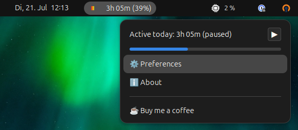

<p align="center"></p>

# Gnome Shell Session Timer

A minimal GNOME Shell extension that shows, right in the top panel, how long
you've actually been active (screen unlocked) today.



## ✨ Features

* **Live panel readout:** Shows a running `Xh YYm` total in the top bar, updated every 20 seconds.
* **Excludes locked/suspended time:** Tracking pauses whenever the screen locks (including automatic locks around suspend) and resumes on unlock, so the number reflects active usage rather than raw login duration.
* **Manual pause/resume:** A pause button in the dropdown menu freezes accumulation independently of screen-lock state, e.g. for a lunch break.
* **Break tracking:** Time spent locked or manually paused is totalled separately and shown in the dropdown menu, along with a count of how many breaks were taken today.
* **Lock grace period:** Short locks (e.g. a quick screen lock to answer a question) don't count as a break if the screen is unlocked again within a configurable grace period; the time is credited back to active work instead. Manual pauses are always counted as breaks.
* **Working-hours progress bar:** Set a daily target in Preferences to get a colour-gradient progress bar in the panel icon and in the dropdown menu, plus an optional percentage in the panel label. Leave the target at 0 to hide it.
* **Resets daily:** The counter rolls over to `0h 00m` at local midnight.
* **Survives restarts:** The running total is checkpointed to a local state file, so a GNOME Shell restart or a quick extension disable/enable doesn't lose today's progress.
* **CSV session log:** Every completed work session (start, end, total `hh:mm`) is appended to a yearly CSV file in `~/.local/share/gnome-shell-session-timer/sessions-<year>.csv`. Sessions merely interrupted by a grace-period lock don't appear as separate rows — they're logged as one continuous session.
* **About dialog & state file viewer:** The dropdown menu includes an About dialog (version, GitHub link, donation link) and a shortcut to open the raw state file.

## 🧩 Dependencies

None to install. Everything used (`GLib`, `GObject`, `Gio`, `Clutter`, `St`) ships as part of GNOME Shell / GJS itself on any of the supported versions (45–50).

## 📦 Installation (Manual)

1. Clone this repository to your preferred location:
   ```bash
   git clone git@github.com:firebirdberlin/gnome-shell-session-timer.git ~/Projects/gnome-shell-session-timer
   ```

2. Create a symbolic link pointing from your GNOME Shell extensions directory to the cloned repository:
   ```bash
   ln -s ~/Projects/gnome-shell-session-timer ~/.local/share/gnome-shell/extensions/gnome-shell-session-timer@firebirdberlin
   ```

   > ⚠️ **Important (Wayland users):** GNOME Shell only scans for new extension directories during startup. If you are running Wayland, you **must log out and log back in now**, otherwise the next step will fail with an error stating the extension does not exist.

3. Enable the extension:
   ```bash
   gnome-extensions enable gnome-shell-session-timer@firebirdberlin
   ```

## ⚙️ Preferences

Open via the ⚙️ Preferences item in the dropdown menu (or `gnome-extensions prefs gnome-shell-session-timer@firebirdberlin`):

* **Maximum working hours:** Daily target, in hours (0–24, quarter-hour steps). Drives the progress bar in the panel icon and menu. Set to `0` to disable it.
* **Show percentage:** Adds the completed percentage to the panel label, e.g. `4h 30m (56%)`.
* **Lock grace period (minutes):** Unlocking within this many minutes of locking counts as working time, not a break. Defaults to 3 minutes; set to `0` to count every lock as a break immediately. Manual pauses are always counted as breaks regardless of this setting.

## How it works

The extension watches GNOME Shell's `org.gnome.ScreenSaver` D-Bus service for
lock/unlock transitions. While unlocked and not manually paused, elapsed
wall-clock time accrues towards today's active total; while locked or
paused, it accrues instead towards today's paused total, and each
active→paused transition increments the break count. When a lock (as
opposed to a manual pause) ends within the configured grace period, the
time it accrued is moved back from paused to active and its break is
un-counted, so brief locks don't interrupt the working total. Both running
totals for the current date are checkpointed to `state.json` next to the
extension code every 20 seconds and on every lock/unlock/pause/disable, so
they can be restored if GNOME Shell restarts mid-day.

Separately, a confirmed break (a manual pause, or a lock that outlasts the
grace period) closes out the work session that preceded it and appends it
as one row — start datetime, end datetime, total `hh:mm` — to
`~/.local/share/gnome-shell-session-timer/sessions-<year>.csv`, creating
that year's file with a header row the first time it's written to. A new
session starts as soon as work resumes. Grace-period locks never close a
session, so short interruptions don't fragment the log.

## 🛠️ Development

```bash
make pack     # build a .shell-extension.zip into dist/
make test     # launch a nested GNOME Shell session for quick manual testing
make release  # bump version, pack, commit, tag and push
```
